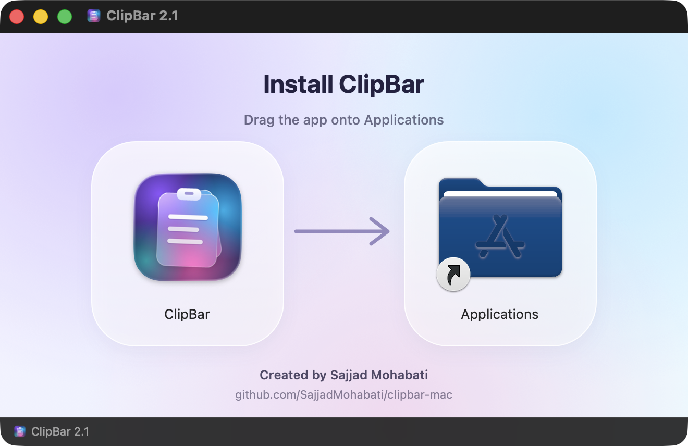

<div dir="rtl">

<p align="center">
  
</p>

<h1 align="center">ClipBar | مدير الحافظة المجاني والاحترافي لنظام macOS</h1>

<p align="center">
  <b>سجل الحافظة في شريط القوائم على ماك، بتصميم زجاجي Liquid Glass</b><br>
  قفل ببصمة الإصبع · لقطات شاشة تلقائية · البحث في النص داخل الصور · لصق فوري
</p>

<p align="center">
  <a href="https://github.com/SajjadMohabati/clipbar-mac/releases/latest"></a>
  
  
  <a href="LICENSE"></a>
  <a href="https://github.com/SajjadMohabati/clipbar-mac/stargazers"></a>
</p>

<p align="center">
  <a href="https://github.com/SajjadMohabati/clipbar-mac/releases/latest"><b>⬇️ تنزيل ClipBar</b></a>
  &nbsp;·&nbsp; <a href="#features">المزايا</a>
  &nbsp;·&nbsp; <a href="#install">التثبيت</a>
  &nbsp;·&nbsp; <a href="#shortcuts">الاختصارات</a>
  &nbsp;·&nbsp; <a href="#faq">الأسئلة الشائعة</a>
  &nbsp;·&nbsp; <a href="README.md">English</a>
  &nbsp;·&nbsp; <a href="README.fa.md">فارسی</a>
</p>

<p align="center">
  
</p>

<p align="center"><sub>من تطوير <a href="https://github.com/SajjadMohabati"><b>سجاد محبتي (Sajjad Mohabati)</b></a></sub></p>

---

## لماذا ClipBar؟

يحفظ ClipBar كل ما تنسخه على جهاز ماك: النصوص والروابط والألوان والصور والملفات. وعندما تحتاج إلى أي منها، تستدعيه باختصار واحد وتلصقه مباشرةً حيث كنت تكتب.

لكن ClipBar أكثر من مجرد سجل بسيط للحافظة:

- 🔐 **قفل ببصمة الإصبع:** تُحفظ أرقام البطاقات البنكية وأرقام الهوية وكلمات المرور في **سلسلة المفاتيح (Keychain)** الخاصة بنظام macOS، لا في ملف عادي. وفي كل مرة تنسخها أو تلصقها أو تعدّلها أو تحذفها، يُطلب منك **Touch ID** أو كلمة مرور الجهاز.
- 📸 **لقطات شاشة تلقائية:** التقط لقطة شاشة بـ ⇧⌘3 أو ⇧⌘4، فتنتقل فورًا إلى الحافظة والسجل وتصبح جاهزة للصق.
- 🔎 **البحث في النص داخل الصور (OCR):** يُقرأ النص الموجود في الصور ولقطات الشاشة على جهازك مباشرةً، فتجد أي لقطة بالكلمات المكتوبة فيها.
- ⚡️ **لصق فوري:** اختر العنصر واضغط **Enter**، فيعود ClipBar إلى التطبيق الذي كنت تعمل فيه ويلصقه في الحقل نفسه. والعناصر التسعة الأولى تُلصق مباشرةً بـ **⌘1 إلى ⌘9**.
- 🫧 **تصميم Liquid Glass:** واجهة زجاجية أصيلة لنظام macOS Tahoe، مع حركات سلسة ووضعين فاتح وداكن.
- 🛡 **خصوصية تامة:** بلا حساب، بلا سحابة، بلا تتبّع، وبلا أي اتصال بالإنترنت. كل بياناتك تبقى على جهازك.
- 🪶 **خفيف ونظيف:** نحو 3000 سطر من لغة Swift، دون أي مكتبات خارجية، ويعمل على جميع أجهزة ماك.
- 🆓 **مجاني ومفتوح المصدر:** بلا اشتراك وبلا مشتريات داخل التطبيق.

<a id="features"></a>

## المزايا

### سجل الحافظة
- يحفظ **النصوص والروابط والألوان والصور والملفات من Finder**، مع اسم التطبيق الذي نسخت منه ووقت النسخ.
- **عوامل تصفية:** الكل · المثبّتة · النصوص · الروابط · الصور · الملفات (التبديل بينها بـ `⇥`).
- **بحث فوري** في النصوص والعناوين والنص داخل الصور، مع دعم كامل للغة العربية.
- **تثبيت** العناصر المهمة أعلى القائمة و**إعادة ترتيبها بالسحب**. ويمكنك سحب أي عنصر وإفلاته داخل تطبيق آخر.
- إذا نسخت الشيء نفسه مرة أخرى، لا يتكرر العنصر، بل ينتقل إلى أعلى القائمة ويُحتسب عدد مرات استخدامه.
- **تنظيف تلقائي** حسب عمر العنصر (من يوم إلى 365 يومًا) وعدد العناصر (من 50 إلى 2000). ويمكن إبقاء العناصر المثبّتة للأبد.

### العناصر المحفوظة والمقفلة
- قائمة منفصلة باسم **Saved** للأشياء التي تلصقها باستمرار: رقم البطاقة، الرقم الجامعي، العنوان، توقيع البريد الإلكتروني.
- أضفها بزر **+**، أو انقل أي عنصر من السجل إليها بـ `⌘S`. هذه العناصر لا تُحذف تلقائيًا أبدًا.
- **أضف عنوانًا لأي عنصر محفوظ**، نصًا كان أو صورة: مثلًا اسم البنك لرقم البطاقة، أو وصفًا للقطة الشاشة. والعناوين قابلة للبحث أيضًا.
- **اقفل العنصر:** تنتقل قيمته إلى **Keychain**، ويظهر في القائمة على شكل `••••••••`، ويتطلب **بصمة الإصبع أو كلمة مرور الجهاز** للصق أو النسخ أو العرض أو التعديل أو الحذف.
- بعد فتح القفل، لديك 30 ثانية لإنجاز عدة إجراءات دون أن يُطلب منك التحقق مرة أخرى.
- عند لصق عنصر مقفل، تُبلَّغ تطبيقات الحافظة الأخرى بأنه سري حتى لا تحفظه.

### لقطات الشاشة والصور
- تُضاف لقطات الشاشة الجديدة (⇧⌘3 و⇧⌘4 و⇧⌘5) **تلقائيًا إلى السجل وتُنسخ إلى الحافظة**.
- إذا غيّرت مجلد حفظ لقطات الشاشة من ⇧⌘5 → Options، يتعرّف ClipBar على المجلد الجديد تلقائيًا.
- **التعرّف على النص في الصور (OCR)** باستخدام إطار Vision من Apple، بالكامل على جهازك. يصبح نص الصور قابلًا للبحث والنسخ.

### اللصق
- **لصق مباشر:** `↩` يلصق العنصر في التطبيق الذي كنت تعمل فيه، و`⌥↩` ينسخه فقط.
- **`⌘1` إلى `⌘9`:** تلصق العناصر التسعة الأولى فورًا دون تغيير التحديد.
- لوحة ClipBar لا تسحب التركيز من التطبيق الآخر، فيبقى الحقل الذي كنت تكتب فيه نشطًا.

### المحرر وتحويل النصوص
- محرر كامل مع لوحة معلومات: عدد الأحرف والكلمات والأسطر، وتفاصيل الروابط، ورموز الألوان (HEX وRGB وHSL)، والنص داخل الصور.
- **تحويل النص بنقرة واحدة:** أحرف كبيرة وصغيرة، Capitalize Words، إزالة المسافات الزائدة، حذف الأسطر الفارغة، ترتيب الأسطر أو إزالة المكرر منها أو دمجها، تنسيق JSON أو ضغطه، وترميز Base64 وURL وفكّه.

### الأمان والخصوصية
- لا يحفظ أبدًا ما تصنّفه تطبيقات إدارة كلمات المرور (مثل 1Password وBitwarden وKeePassXC) على أنه **سري**.
- يتعرّف تلقائيًا على **المفاتيح الخاصة ورموز API** (GitHub وOpenAI وStripe وAWS وSlack وGoogle وغيرها) و**أرقام البطاقات البنكية** (بخوارزمية Luhn) ولا يحفظها.
- **إيقاف التسجيل مؤقتًا** من قائمة النقر بزر الماوس الأيمن على أيقونة شريط القوائم.
- لا يتصل بالإنترنت إطلاقًا. تُحفظ البيانات فقط في `~/Library/Application Support/ClipBar/`.

### أصيل وخفيف
- تطبيق في شريط القوائم مع **اختصار عام قابل للتخصيص** (الافتراضي `⇧⌘V`) وتشغيل تلقائي عند بدء الجهاز.
- تصميم Liquid Glass، وتحكم كامل بلوحة المفاتيح، ووضعان فاتح وداكن.
- ملف واحد يعمل على **Apple Silicon وIntel**، مكتوب بـ Swift 6 وSwiftUI وAppKit.

<a id="install"></a>

## التثبيت

**المتطلبات:** macOS 26 Tahoe أو أحدث، على أجهزة ماك بمعالج Apple Silicon أو Intel.

### التنزيل (موصى به)

1. نزّل ملف **`ClipBar-2.2.dmg`** من [صفحة أحدث إصدار](https://github.com/SajjadMohabati/clipbar-mac/releases/latest).
2. افتحه واسحب **ClipBar** إلى **Applications**.

<p align="center">
  
</p>

3. افتح ClipBar. لأنه تطبيق مستقل مفتوح المصدر وغير موثّق (Notarized) من Apple، يعرض macOS تحذيرًا في المرة الأولى. اضغط **Done**، ثم افتح **System Settings → Privacy & Security**، وانزل إلى الأسفل واضغط **Open Anyway**. هذه الخطوة مطلوبة مرة واحدة فقط.

   وإن كنت تفضّل الطرفية (Terminal)، فهذا الأمر يؤدي الغرض نفسه:

<div dir="ltr">

```bash
xattr -dr com.apple.quarantine /Applications/ClipBar.app
```

</div>

4. اضغط **`⇧⌘V`** أو انقر على أيقونة الحافظة في شريط القوائم.

### السماح باللصق المباشر

ليتمكن ClipBar من اللصق مباشرةً في التطبيقات الأخرى، يحتاج إلى إذن **Accessibility**. اضغط **Allow…** في اللوحة، أو فعّل ClipBar من **System Settings → Privacy & Security → Accessibility**. ومن دون هذا الإذن، ينسخ ClipBar العنصر وتضغط أنت `⌘V`.

### البناء من المصدر

يتطلب Swift 6 (Xcode 26 أو Command Line Tools).

<div dir="ltr">

```bash
git clone https://github.com/SajjadMohabati/clipbar-mac.git
cd clipbar-mac
./build.sh install
```

</div>

| الأمر | وظيفته |
| --- | --- |
| `./build.sh` | يبني التطبيق داخل مجلد المشروع |
| `./build.sh install` | يبنيه وينسخه إلى Applications ويشغّله |
| `./build.sh dmg` | يبني ملف التثبيت لجميع أجهزة ماك في `dist/` |

<a id="shortcuts"></a>

## اختصارات لوحة المفاتيح

| المفتاح | الوظيفة |
| --- | --- |
| `⇧⌘V` | فتح ClipBar (قابل للتغيير من الإعدادات) |
| `↑` `↓` | التنقل بين العناصر |
| `↩` | لصق العنصر المحدد |
| `⌥↩` | نسخ فقط دون لصق |
| `⌘1` إلى `⌘9` | لصق العنصر من 1 إلى 9 |
| `⇥` / `⇧⇥` | عامل التصفية التالي / السابق |
| `⌘[` / `⌘]` | السجل / العناصر المحفوظة |
| `⌘S` | النقل إلى العناصر المحفوظة |
| `⌘P` | تثبيت العنصر أو إلغاء تثبيته |
| `⌘E` | العرض والتعديل |
| `⌘⌫` | الحذف |
| `⌘,` | الإعدادات |
| `Esc` | مسح البحث، ثم إغلاق اللوحة |

<a id="faq"></a>

## الأسئلة الشائعة

<details>
<summary><b>هل ClipBar مجاني؟</b></summary>

نعم. ClipBar مجاني بالكامل ومفتوح المصدر برخصة MIT، بلا اشتراك ولا حساب ولا مشتريات داخل التطبيق.
</details>

<details>
<summary><b>هل تُرسل بيانات الحافظة إلى أي مكان؟</b></summary>

لا. لا يتصل ClipBar بالإنترنت إطلاقًا. يُحفظ السجل على جهازك فقط في `~/Library/Application Support/ClipBar/`، وتُحفظ قيم العناصر المقفلة في Keychain.
</details>

<details>
<summary><b>كيف أحفظ رقم بطاقتي أو كلمة مروري بأمان في ClipBar؟</b></summary>

أضفه في قسم **Saved** بزر **+** وفعّل خيار **Lock with Touch ID**. تنتقل القيمة إلى Keychain، وتُخفى في القائمة، وتتطلب بصمة الإصبع أو كلمة مرور الجهاز في كل مرة تستخدمها.
</details>

<details>
<summary><b>لماذا تظهر لقطة الشاشة بعد بضع ثوانٍ؟</b></summary>

لا يحفظ macOS لقطة الشاشة إلا بعد اختفاء المعاينة الصغيرة في زاوية الشاشة، أي بعد نحو خمس ثوانٍ. افتح ⇧⌘5 → Options وألغِ تحديد **Show Floating Thumbnail** لتُضاف فورًا. أما اللقطات التي تلتقطها مع الضغط على **Control** (⌃⇧⌘3 أو ⌃⇧⌘4) فتذهب مباشرةً إلى الحافظة وتظهر في ClipBar على الفور.
</details>

<details>
<summary><b>لماذا يطلب macOS الوصول إلى Desktop أو Pictures؟</b></summary>

لأن لقطات الشاشة تُحفظ هناك. يقرأ ClipBar هذا المجلد فقط ليضيف لقطات الشاشة الجديدة إلى السجل. ويمكنك إيقاف هذه الميزة من Settings → Screenshots.
</details>

<details>
<summary><b>هل يعمل على أجهزة ماك بمعالج Intel وإصدارات macOS الأقدم؟</b></summary>

يعمل على كلا النوعين، Apple Silicon وIntel. لكنه يتطلب macOS 26 Tahoe، لأن واجهته مبنية على Liquid Glass الذي ظهر في هذا الإصدار.
</details>

<details>
<summary><b>هل يعرض النصوص العربية بشكل صحيح؟</b></summary>

نعم. تُعرض النصوص العربية والنصوص من اليمين إلى اليسار بشكل صحيح في القائمة والبحث والمحرر، كما يتعرّف استخراج النص من الصور على اللغة تلقائيًا.
</details>

## بياناتك

يُحفظ كل شيء في `~/Library/Application Support/ClipBar/`:

- `history.json`: سجل الحافظة
- `saved.json`: العناصر المحفوظة (قيم العناصر المقفلة في Keychain، لا في هذا الملف)
- `Images/`: الصور المنسوخة بصيغة PNG، وتُحفظ الصورة مرة واحدة فقط مهما نسختها

للبدء من جديد، أغلق ClipBar واحذف هذا المجلد.

## المساهمة

نرحّب بتقارير الأخطاء والأفكار وطلبات الدمج (Pull Requests). ابدأ من قسم [Issues](https://github.com/SajjadMohabati/clipbar-mac/issues).
وإن أفادك ClipBar، فساعد الآخرين على اكتشافه بإضافة ⭐️ على GitHub.

## المطوّر

من تطوير **سجاد محبتي (Sajjad Mohabati)** · [github.com/SajjadMohabati](https://github.com/SajjadMohabati)

## الرخصة

[MIT](LICENSE) © سجاد محبتي (Sajjad Mohabati)

<sub>كلمات مفتاحية: مدير الحافظة لماك، برنامج الحافظة لنظام ماك، سجل الحافظة macOS، إدارة النسخ واللصق في ماك، تطبيق شريط القوائم لماك، حافظة مجانية لماك، برنامج نسخ ولصق لماك، حفظ النصوص المنسوخة في ماك، لقطة الشاشة إلى الحافظة، التعرف على النص في الصور، قفل ببصمة الإصبع، macOS Tahoe، Liquid Glass، clipboard manager for Mac.</sub>

</div>
