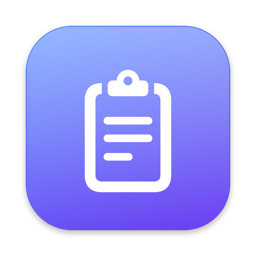
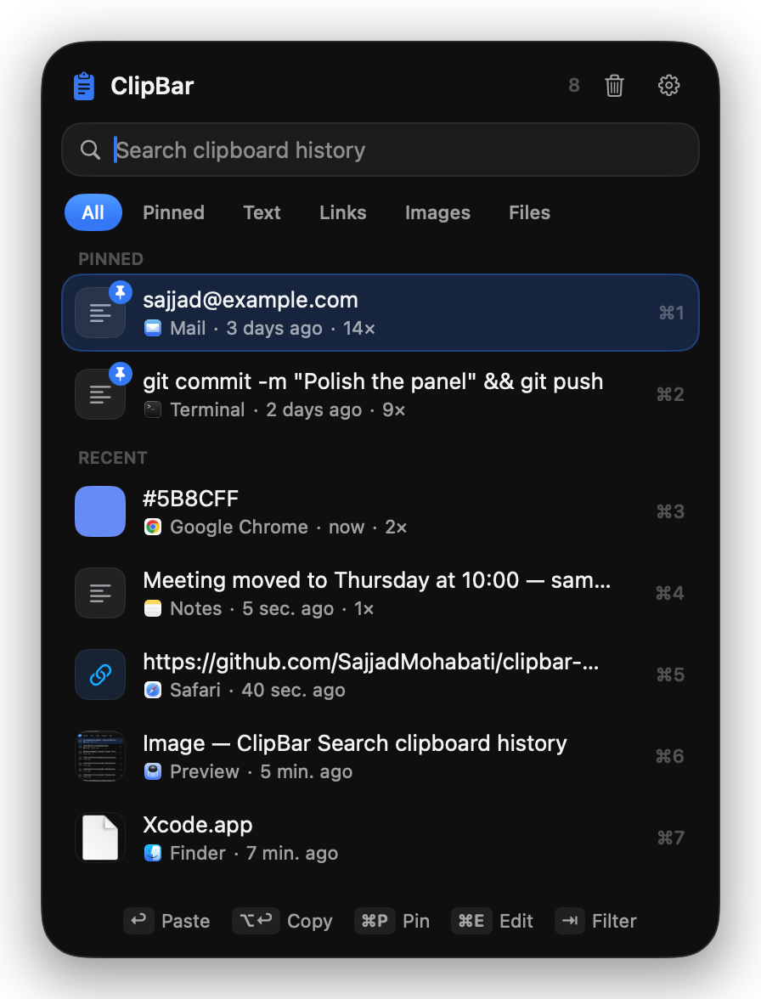

<p align="center">
  
</p>

<h1 align="center">ClipBar</h1>

<p align="center">
  A fast, private clipboard history for the macOS menu bar, built with SwiftUI and Liquid Glass.
</p>

<p align="center">
  
</p>

## Features

- **Everything you copy:** text, links, colors, images and files from Finder, with the source app and when you copied it
- **Paste directly:** pick an item and ClipBar switches back to your app and pastes it (`↩`), or just copies it (`⌥↩`)
- **Quick access:** `⌘1`–`⌘9` paste the first nine items, and arrow keys plus search get you to the rest
- **Screenshots, automatically:** every ⇧⌘3 / ⇧⌘4 / ⇧⌘5 screenshot lands in the history and on the clipboard, ready to paste
- **Text in images:** text inside copied screenshots is recognized on-device, so images show up in search too
- **Filters:** All · Pinned · Text · Links · Images · Files (`⇥` to cycle)
- **Pin and reorder:** keep snippets at the top and drag rows to reorder them. You can also drag a row into another app to drop its content there
- **Editor:** view and edit any item, with transforms (case, trim, sort/unique lines, JSON format/minify, Base64, URL encode/decode)
- **Privacy:** skips anything password managers mark as confidential, plus private keys, API tokens and card numbers. Nothing ever leaves your Mac
- **Pause capturing** from the menu bar icon's right-click menu
- **Auto cleanup** by age and item count, launch at login, and a custom global shortcut

## Shortcuts

| Key | Action |
| --- | --- |
| `⇧⌘V` | Open ClipBar (customizable) |
| `↑` `↓` | Move selection |
| `↩` | Paste selected item |
| `⌥↩` | Copy without pasting |
| `⌘1`–`⌘9` | Paste item 1–9 |
| `⌘P` | Pin / unpin |
| `⌘E` | View and edit |
| `⌘⌫` | Delete |
| `⇥` / `⇧⇥` | Next / previous filter |
| `⌘,` | Settings |
| `Esc` | Clear search, then close |

## Install

Requires macOS 26 and the Swift 6 toolchain (Xcode 26 or the command line tools).

```bash
git clone https://github.com/SajjadMohabati/clipbar-mac.git
cd clipbar-mac
./build.sh install
```

`./build.sh` alone builds `ClipBar.app` in the project folder without installing it.

To paste directly into other apps, ClipBar needs **Accessibility** access
(System Settings → Privacy & Security → Accessibility). Without it, ClipBar still copies the item
and you press `⌘V` yourself.

By default the app is ad-hoc signed, so macOS treats every rebuild as a new app and the old
Accessibility entry stops working (it stays switched on but does nothing). Remove it with **−** and add
ClipBar again. To avoid this, sign with a stable certificate: in Keychain Access choose
*Certificate Assistant → Create a Certificate…*, name it `ClipBar Local`, set the type to **Code Signing**, then:

```bash
CLIPBAR_SIGN_IDENTITY="ClipBar Local" ./build.sh install
```

## Data

History is stored locally in `~/Library/Application Support/ClipBar/`:
`history.json` holds the items and `Images/` holds copied images as PNG files.

## Project layout

```
Sources/ClipBar/
  App.swift          menu bar item, panel, windows, keyboard handling
  ClipView.swift     the menu bar panel
  EditorView.swift   item viewer / editor window
  SettingsView.swift settings window
  ScreenshotWatcher.swift picks up new screenshots via Spotlight
  Store.swift        history model, capture, cleanup, persistence
  Clipboard.swift    pasteboard I/O, secret detection, image storage, OCR
  Transforms.swift   text transforms
  HotKey.swift       global shortcut
  Settings.swift     preferences
```

## License

MIT © Sajjad Mohabati
